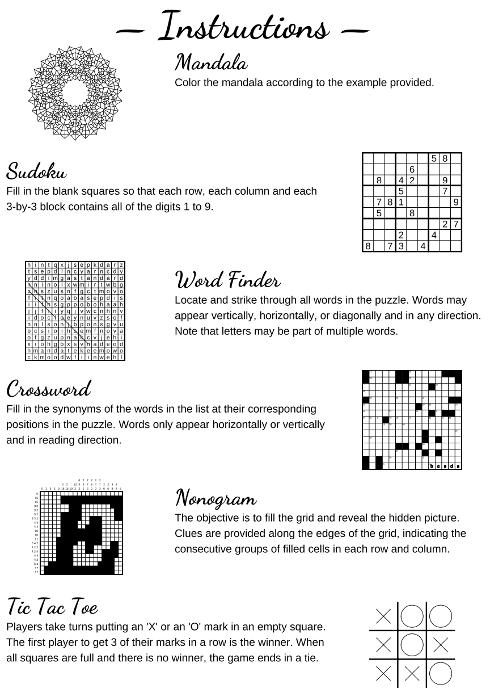

# Genigma: Generative Puzzles

Source code for the book Genigma: Generative Puzzles.

- [Read online](https://koenderks.github.io/genigma/)
- [PDF version](https://koenderks.github.io/genigma/Genigma--Generative-Puzzles.pdf)
- [ePub version](https://koenderks.github.io/genigma/Genigma--Generative-Puzzles.epub)

